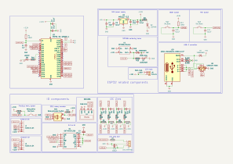

# BowlingPassMonitor
An ESP32 project that uses 2 VL53L1X sensors and an array of 39 addressable LEDs to detect and show a bowling ball passing point. The program features a menu with 3 modes (free, single target, and range) selectable via an encoder and two buttons to navigate the menu.

# How to use

## Before flashing firmware

Check the `config.h` file and change all the values to your needs. Pay attention to pin numbers as they may vary based on your board; check the [Electrical Scheme](#electrical-scheme) for details.

Once you are sure the pin numbering is correct you can proceed with flashing the firmware on your ESP32.

## Flashing

The project uses PlatformIO as development platform. Opening the project with PlatformIO allows direct upload to an ESP32-S3 chip.

# Technical info

## Menu
The project features a complete and flexible menu with the possibility to navigate through submenus, change values, and perform any other action.

As for the current project state, there isn't yet a “settings” page, but any configuration can be changed via the `config.h` file.

### Menu structure

The menu is structured kind of like an n-ary tree:ù

When the menu is first loaded, the `selectedItem` variable points to `Root.firstChild`, that being the first item of the first menu.

Moving the selection across the items moves the `selectedItem` pointer either to `nextSibling` or `prevSibling` to constantly keep track of the user's current position.

Selecting an item that has a child moves `selectedItem` to `selectedItem.firstChild`.

In this example we would see a main menu containing the 3 items `item1`, `item2` and `item3`, after selecting the `item2` item, `selectedItem` pointer goes from `Item2` to `Item2.firstChild` aka `Item2.1`.

Going back to the previous menu level is done by moving `selectedItem` to `selectedItem.parent`.

### Item structure
Each item on the menu consists of the following elements:

- Label: The name of the item; this value is what's shown when the item is displayed.

- firstChild: If the item has a sub-menu, this pointer refers to the first item of that menu;

- nextSibling: The next item that should be shown in the menu. This pointer is used to move along the menu and to show the items alongside prevSibling and thus should be kept coherent to it.
    > A “wrapped” menu can be achieved by making “nextSibling” of the last item point to the first item and vice versa.\
    > Note that as of now there is no way for the menu to know if an item has already been printed; therefore, if the number of items is less than maxLines, there will be repeated items.

- prevSibling: The previous item in the menu. Everything said for nextSibling is also true for this;

- valueConfig: If the item has a value associated with it, this pointer refers to an ItemConfig struct containing all necessary information to work with the value;

- action: The action to perform when an item is selected and the select button is pressed.

> Unless an ad-hoc action is implemented, the firstChild and valueConfig elements cannot be managed both in the same element.\
> As of now an item with a valueConfig item associated is considered a "leaf" (item with no childs), and the only action it can perform is to enable the value editing mode.\
> The same goes for an item with a child; if it has a child there are no reasons for it to have a value and therefor the only action it can perform is to select it's child.

> An item with no action simply won't do anything.

## Electrical scheme
The proposed electrical scheme refers to a complete and all-in-one PCB including the ESP32-S3-MINI-1 IC, step-down regulators from 12V to 5V and from 5V to 3.3V, a USB-C connection, and RES and BOOT buttons. If interested in just the IO parts wiring, check the "IO components" section of the schema.

### Notes 

- Pay attention to pull-up or pull-down resistors as they may vary depending on your configuration. For most ESP32 chips, internal pull-up resistors are available; using external resistor is suggested.

- If using external pull-up or pull-down resistors there is no need to specify the pin modes as `INPUT_PULLUP` or `INPU_PULLDOWN`; change them to `INPUT` accordingly.\
Althoug in the schema 10k resistors are placed for Menu and Select buttons, the code specify the corresponding pins mode as `INPUT_PULLUP`; this is because I added them in schema after making the PCB and thus my board doesn't have external pull-up's.

- The D1 diode is used to isolate the LED's power line from the other parts. It stops the LED strip from receiving power from USB-C, which could draw up to 2.6A and damage the port.

- In the "IO components" section is also represented a schema for setting up I2C lines with a pullup resistor and a small resistor and condenser for noise-reduction purposes; This part can be changed according to your needs, most importantly the pullup resistor might be resized based on I2C lines length.

## Conventions

- Listel numbering starts from the left;

- Bowling ball size is estimated at 217 mm; this dimension is given by averaging the maximum and minimum allowed ball size (can be changed in `config.h`).